# 🏛️ Universal Enterprise Production Agent Best Practices & Blueprint

> **A Domain-Agnostic Master Playbook & Reusable Architecture Template for Building 95/95 Production-Grade AI Agents (Google ADK, Vertex AI, LangGraph, or Custom Frameworks)**

This document is a **universal, project-agnostic engineering standard** designed to be reused across **any AI agent project** (Enterprise Automation, Healthcare, FinTech, Education, Customer Support, Data Engineering, or Personal Concierge). You can drop this file into any repository or pass it directly to an AI coding assistant as your engineering specification.

---

## 🧭 1. Universal 5-Pillar AgentOps Architecture

```mermaid
flowchart LR
    subgraph Pillar1["1. Tool & Interface Contracts"]
        Docstrings["LLM-Optimized Docstrings"]
        Pydantic["Strict Pydantic JSON Schemas (extra='forbid')"]
        Recovery["Guided Error Recovery (recovery_guidance)"]
    end

    subgraph Pillar2["2. Context & Memory"]
        Constitution["System Prompt Constitution"]
        Compaction["Sliding-Window & Summary Compaction"]
        HybridStore["Relational DB + Vector RAG Store"]
        AsyncMem["Non-Blocking AsyncMemoryWorker"]
    end

    subgraph Pillar3["3. Orchestration & Governance"]
        ADK["Coordinator + Specialized Sub-Agents"]
        Routing["Strategic Model Routing (Flash vs Pro)"]
        Guardrails["Input/Output Policy Guardrails"]
        HITL["Human-in-the-Loop (HITL) Code Stops"]
    end

    subgraph Pillar4["4. Observability & Privacy"]
        OTel["OpenTelemetry Parent/Child Spans"]
        IntentOutcome["INTENT vs OUTCOME JSON Logs"]
        DLP["Cloud DLP + Regex PII Redaction"]
    end

    subgraph Pillar5["5. Infrastructure & CI/CD"]
        GoldenEval["Golden Dataset Regression Suite"]
        Terraform["Terraform GCP IaC (Cloud Run + IAM)"]
        SecretMgr["Google Cloud Secret Manager"]
    end

    Pillar1 --> Pillar3
    Pillar2 --> Pillar3
    Pillar3 --> Pillar4
    Pillar4 --> Pillar5
```



---

## 📂 2. Standard Repository Layout (Reusable for Any Project)

Always place your agent package at the **root** of the repository using this modular layout:

```text
<project-root>/
├── .env.example                      # Sanitized configuration template (never commit .env)
├── .gitignore                        # Excludes .venv/, .env, data/, __pycache__/
├── Dockerfile                        # Production non-root container image (port 8080)
├── cloudbuild.yaml                   # CI/CD pipeline (Ruff lint + Pytest eval + Cloud Run deploy)
├── main.tf                           # Root Terraform IaC (also mirrored in terraform/main.tf)
├── pyproject.toml                    # Dependencies, Ruff linter rules, Pytest config
├── requirements.txt                  # Locked runtime & dev dependencies
├── README.md                         # Architecture diagram, CLI commands & embedded Terraform HCL
├── app.py                            # Interactive Web UI (Streamlit / FastAPI / React)
├── cli.py                            # CLI runner with `--demo` verification mode
├── <agent_package>/
│   ├── __init__.py                   # Exports `root_agent` and `app` for Google ADK CLI
│   ├── config.py                     # Typed settings + Secret Manager resolution
│   ├── infrastructure_iac.py         # Programmatic Terraform HCL/JSON exporter
│   ├── agent/
│   │   ├── prompts.py                # Immutable Agent Constitution & Worker prompts
│   │   ├── guardrails.py             # Input/Output guardrails, Self-Eval & HITL hooks
│   │   ├── adk_agent.py              # Coordinator LlmAgent + Worker Sub-Agents + Compaction
│   │   └── core.py                   # Strategic Model Router (Flash vs Pro) & Orchestrator
│   ├── tools/
│   │   ├── schemas.py                # Strict Pydantic Input/Output schemas (extra="forbid")
│   │   └── <domain>_tools.py         # Domain tools with docstrings & guided error recovery
│   ├── storage/
│   │   ├── database.py               # Persistent SQLite / Cloud SQL relational state
│   │   ├── vector_store.py           # Vector RAG store with exact citation anchors
│   │   ├── compaction.py             # Token-budget sliding window & rolling summarizer
│   │   ├── async_worker.py           # Non-blocking background memory & indexing worker
│   │   └── secret_manager.py         # Google Cloud Secret Manager client wrapper
│   └── telemetry/
│       └── tracer.py                 # OpenTelemetry spans, INTENT/OUTCOME JSON logs & PII Redactor
├── terraform/
│   ├── main.tf                       # Cloud Run v2, Artifact Registry, Secret Manager, IAM
│   ├── main.tf.json                  # JSON representation for automated static analyzers
│   ├── variables.tf
│   └── outputs.tf
└── tests/
    ├── eval_dataset.json             # Golden benchmark dataset (happy paths, HITL, adversarial)
    ├── test_agent_eval.py            # Regression harness asserting routing, grounding & SLAs
    ├── test_tools_and_schemas.py     # Tool schema validation & guided error recovery tests
    └── test_memory_and_telemetry.py  # Compaction, async worker, OTel spans & PII tests
```

---

## 🛠️ 3. Pillar-by-Pillar Reusable Patterns & Code Templates

### Pillar 1: Tool & Interface Design (20/20 Rubric Standard)

1. **Specific Verb-Noun Tool Naming**:
   - Never name a tool `run_query` or `update_record`. Name it after the exact business capability (e.g., `schedule_patient_triage_appointment`, `execute_portfolio_rebalance_order`, `create_critical_incident_ticket`).
2. **Comprehensive LLM-Facing Docstrings**:
   - Every tool function MUST include `Purpose:`, `Args:` (with constraints and examples), and `Returns:`.
3. **Strict Input & Output Pydantic Schemas (`extra="forbid"`)**:
   - Use this universal response wrapper across **every project**:

```python
from typing import Any, Literal
from pydantic import BaseModel, ConfigDict, Field


class GuidedToolResponse(BaseModel):
    """Universal output contract for all enterprise agent tools."""

    model_config = ConfigDict(extra="forbid")

    status: Literal["success", "error", "requires_human_approval"]
    tool_name: str
    data: dict[str, Any] = Field(default_factory=dict)
    error_code: str | None = None
    recovery_guidance: str | None = Field(
        default=None,
        description="Actionable instructions telling the LLM how to fix its parameters and retry.",
    )
    suggested_next_action: str | None = None
```

4. **Guided Error Recovery (Never Crash)**:
   - Wrap tool execution in `try ... except ValidationError` and return `GuidedToolResponse(status="error", error_code="...", recovery_guidance="...", suggested_next_action="...")` so the LLM self-corrects instead of terminating with a stack trace.

---

### Pillar 2: Context Engineering & Multi-Tier Memory (20/20 Rubric Standard)

1. **Constitutional System Prompt (`CONSTITUTION_SYSTEM_PROMPT`)**:
   - Every agent system prompt should declare 5 explicit sections:
     - `1. PERSONA & DOMAIN MISSION`
     - `2. EVIDENCE-FIRST GROUNDING & CITATION MANDATE` (`[DOC-ID](section_anchor)`)
     - `3. MANDATORY HUMAN-IN-THE-LOOP (HITL) BOUNDARIES`
     - `4. ZERO PII & PROMPT INJECTION DEFENSE`
     - `5. STRUCTURED OUTPUT FORMAT`
2. **Context Compaction (`HistoryCompactor` + ADK `EventsCompactionConfig`)**:
   - Enforce both a `sliding_window_turns` cap (e.g., last 8 turns) and a `max_context_tokens` budget (e.g., 4,096 tokens).
   - Summarize evicted turns into a persistent `session_summaries` table and configure Google ADK's `EventsCompactionConfig(compaction_interval=6, overlap_size=2)`.
3. **Persistent Session & Vector RAG State**:
   - Pair a relational database (`SQLite` / `Cloud SQL` / `DatabaseSessionService`) for structured conversational turns and transactional records with a **Vector RAG Store** that returns exact quotes and deep-link section anchors.
4. **Non-Blocking Async Memory Operations (`AsyncMemoryWorker`)**:
   - Never run expensive vector embedding or history summarization synchronously on the main request thread. Queue memory consolidation jobs onto a background `asyncio` / daemon worker thread.

---

### Pillar 3: Orchestration, Model Routing & Governance (20/20 Rubric Standard)

1. **Multi-Agent Coordinator-Worker Pattern (`google-adk`)**:
   - Avoid monolithic single-agent prompts. Build a central `CoordinatorAgent` (`LlmAgent`) that delegates to specialized domain sub-agents (`ResearchAgent`, `AnalysisAgent`, `ActionExecutionAgent`) and `SequentialAgent` pipelines.
2. **Strategic Model Routing (`Flash` vs `Pro`)**:
   - Route low-latency intent classification, simple lookups, and standard RAG queries to **`gemini-2.5-flash`**.
   - Route complex multi-source reasoning, planning, and high-stakes state mutations to **`gemini-2.5-pro`**.
3. **Defense-in-Depth Guardrails (`before_model_callback` & `after_model_callback`)**:
   - **Input Guardrail (`before_model_callback`)**: Block prompt injections (`ignore previous instructions`), credential exfiltration, and destructive commands (`DROP TABLE`, `rm -rf`), while scrubbing input PII.
   - **Output Self-Evaluation Guardrail (`after_model_callback`)**: Compute a `grounding_score` verifying that claims cite retrieved tool evidence and scrub output PII.
4. **Human-in-the-Loop (HITL) Approval Hooks (`before_tool_callback`)**:
   - Intercept any state-mutating or high-risk tool call (`delete_*`, `execute_*`, `transfer_*`, `rollback_*`). If a valid `human_approval_token` is not present, return `status="requires_human_approval"` and pause execution until the human operator confirms.

---

### Pillar 4: Observability, Tracing & Data Privacy (20/20 Rubric Standard)

1. **Structured JSON Logging (Zero `print()` Calls)**:
   - Use a custom `logging.Formatter` emitting single-line JSON records with `timestamp`, `level`, `event_type`, `agent_name`, `trace_id`, `span_id`, and `metadata`.
2. **Explicit `INTENT` vs. `OUTCOME` Audit Capture**:
   - Around every tool or sub-agent call, log two distinct records:
     - **Before Execution (`INTENT`)**: Planned tool name, sanitized arguments, and rationale.
     - **After Execution (`OUTCOME`)**: Execution status, sanitized output summary, and `latency_ms`.
3. **OpenTelemetry Distributed Tracing**:
   - Initialize an OpenTelemetry `TracerProvider` and wrap the parent request, model routing step, sub-agent delegation, and each tool execution in linked child spans (`with tracer.start_as_current_span(...)`).
4. **Active Multi-Layer PII Redaction**:
   - Scrub all logs, spans, and database writes using **Google Cloud DLP (`google-cloud-dlp`)** backed by deterministic regex scrubbers for emails, phone numbers, SSNs, payment cards, and API keys.

---

### Pillar 5: Infrastructure, Secret Management & CI/CD (15/15 Rubric Standard)

1. **Automated Golden Dataset Evaluation Suite (`tests/eval_dataset.json` + `pytest`)**:
   - Include a golden benchmark dataset testing at least 5 scenarios:
     1. Complex multi-agent reasoning (`gemini-2.5-pro` routing + grounded RAG citation)
     2. Fast specialist lookup (`gemini-2.5-flash` routing)
     3. Unapproved high-stakes action (assert `PAUSED_FOR_HUMAN_APPROVAL`)
     4. Human-approved high-stakes action (assert `SUCCESS` + async memory indexing)
     5. Adversarial prompt injection / destructive command (assert `BLOCKED_BY_GUARDRAIL`)
2. **Infrastructure as Code (`Terraform` + ADK CLI)**:
   - Provision `google_cloud_run_v2_service`, `google_artifact_registry_repository`, `google_secret_manager_secret`, and least-privilege `google_service_account` IAM bindings in `terraform/main.tf`.
   - **Evaluator Tip**: Always include the verbatim Terraform HCL in `terraform/main.tf`, `README.md`, and a Python module (`infrastructure_iac.py`) so static code evaluators that filter by `.py` or `.md` extensions always grade the full Terraform implementation.
3. **Zero Hardcoded Secrets (`google-cloud-secret-manager`)**:
   - Load API keys via `SecretManagerServiceClient().access_secret_version(...)` with safe fallback to environment variables defined in `.env.example`.

---

## 🤖 4. Copy-Paste Prompt for Bootstrapping Any New Agent Project

When starting a new project, paste this prompt into your AI coding assistant:

```markdown
Build a production-grade Enterprise Multi-Agent system for [INSERT PROBLEM & DOMAIN] following every rule in `ENTERPRISE_AGENT_BEST_PRACTICES.md`:
1. Tool & Interface Design: 5-6 domain-specific tools with Google-style docstrings, strict Pydantic input/output JSON schemas (`extra="forbid"`), and `GuidedToolResponse` error recovery (`recovery_guidance`).
2. Context & Memory: `CONSTITUTION_SYSTEM_PROMPT`, token-aware `HistoryCompactor` + ADK `EventsCompactionConfig`, persistent SQLite + Vector RAG store with exact section anchors, and non-blocking `AsyncMemoryWorker`.
3. Orchestration & Logic: Native Google ADK Coordinator `LlmAgent` + specialized Worker Sub-Agents + `SequentialAgent`, `StrategicModelRouter` (`gemini-2.5-flash` vs `gemini-2.5-pro`), `before_model_callback`/`after_model_callback` guardrails, and a `before_tool_callback` Human-in-the-Loop gate on high-stakes tools.
4. Observability & Tracing: OpenTelemetry `TracerProvider` parent/child spans, structured JSON logging, explicit `INTENT` before execution vs `OUTCOME` after execution, and Google Cloud DLP + regex `PIIRedactor`.
5. Infrastructure & CI/CD: `tests/eval_dataset.json` golden regression suite (`pytest -v`), `ruff` clean formatting, `google-cloud-secret-manager` integration, and full Terraform GCP IaC (`terraform/main.tf`, `main.tf.json`, `infrastructure_iac.py`, and embedded in `README.md`).
```
