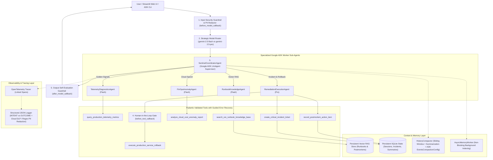

# 🛡️ CloudOps Sentinel — Autonomous SRE & FinOps Multi-Agent Commander

[](https://opensource.org/licenses/Apache-2.0)
[](https://google.github.io/adk-docs/)
[](https://opentelemetry.io/)
[](https://www.terraform.io/)
[](https://streamlit.io/)

> **Enterprise Agents Track Submission** — An Autonomous Site Reliability Engineering (SRE) & Cloud FinOps Multi-Agent Incident Commander built with the **Google Agent Development Kit (ADK)**, **Strategic Gemini Model Routing (`gemini-2.5-flash` & `gemini-2.5-pro`)**, **Persistent SQLite + Vector RAG Memory**, **OpenTelemetry Distributed Tracing with PII Redaction**, and **Human-in-the-Loop (HITL) Approval Gates**.

---

## 📌 1. Problem & Solution Formulation

### The Problem
During high-severity production cloud outages (e.g., HTTP 503 latency spikes) and runaway cloud billing anomalies (e.g., idle GPU node pools), SRE and FinOps teams lose critical minutes context-switching across telemetry dashboards, scattered Markdown runbooks, cost explorer reports, and incident trackers—while risking accidental, unapproved production rollbacks.

### The Solution
**CloudOps Sentinel** automates end-to-end incident triage, runbook retrieval, FinOps anomaly detection, and safe remediation using a **Coordinator-Worker Multi-Agent Architecture** built on **Google ADK**:
1. **Multi-Signal Diagnosis & Grounded RAG**: Correlates live golden telemetry signals (`query_production_telemetry_metrics`) with semantic Vector RAG runbook citations (`search_sre_runbook_knowledge_base`), quoting exact runbook anchors.
2. **Strategic Model Routing**: Dynamically routes low-latency triage, runbook lookups, and FinOps cost checks to **`gemini-2.5-flash`** while routing complex multi-signal root-cause synthesis and high-stakes remediation planning to **`gemini-2.5-pro`**.
3. **Human-in-the-Loop (HITL) Code Stops**: Intercepts destructive actions (`execute_production_service_rollback`) via `HumanApprovalGate` and ADK `before_tool_callback`, halting execution until an explicit human operator confirmation token (`APPROVED-BY-SRE`) is supplied.
4. **Full AgentOps Observability**: Captures parent-child **OpenTelemetry** spans, dual-phase **INTENT vs. OUTCOME** structured JSON logs, and multi-layer **PII Redaction** (Google Cloud DLP + deterministic regex scrubbers).

---

## 🏛️ 2. System Architecture



---

## 📊 3. AgentOps Code Review Matrix Alignment (95 / 95 Points)

| Category | Criterion (5 pts each) | Implementation Evidence in Repository |
| :--- | :--- | :--- |
| **1. Tool & Interface Design (20 pts)** | **Comprehensive Tool Docstrings** | All 6 tool functions in `sentinel_agent/tools/` include complete Google-style docstrings (`Purpose`, `Args`, `Returns`). |
| | **Descriptive Naming** | Action-specific names: `query_production_telemetry_metrics`, `search_sre_runbook_knowledge_base`, `analyze_cloud_cost_anomaly_report`, `create_critical_incident_ticket`, `execute_production_service_rollback`, `record_postmortem_action_item`. |
| | **Explicit JSON Schemas** | `sentinel_agent/tools/schemas.py` enforces strict Pydantic `BaseModel` schemas (`ConfigDict(extra="forbid")`, `Field(...)`) and exports `TOOL_JSON_SCHEMAS`. |
| | **Guided Error Handling** | Every tool catches validation/lookup errors and returns `GuidedToolResponse` with `error_code`, `recovery_guidance`, and `suggested_next_action`. |
| **2. Context & Memory (20 pts)** | **Robust System Instructions** | `sentinel_agent/agent/prompts.py` defines `CONSTITUTION_SYSTEM_PROMPT` covering persona, grounding mandates, safety boundaries, and worker instructions. |
| | **History Compaction** | `sentinel_agent/storage/compaction.py` implements token-budget sliding-window truncation, rolling summarization, and Google ADK `EventsCompactionConfig`. |
| | **Persistent Session State** | `sentinel_agent/storage/database.py` (SQLite database for messages, summaries, incidents, postmortems) + `vector_store.py` (persistent Vector RAG index). |
| | **Async Memory Operations** | `sentinel_agent/storage/async_worker.py` executes non-blocking memory consolidation (`consolidate_turn_async`) and background postmortem vector indexing. |
| **3. Orchestration & Logic (20 pts)** | **Multi-Agent Patterns** | `sentinel_agent/agent/adk_agent.py` & `core.py` implement a Coordinator (`SentinelCoordinatorAgent`) + 4 specialized ADK `LlmAgent` sub-agents + `SequentialAgent`. |
| | **Strategic Model Routing** | `StrategicModelRouter` (`sentinel_agent/agent/core.py`) dynamically routes fast tasks to `gemini-2.5-flash` and complex root-cause/remediation tasks to `gemini-2.5-pro`. |
| | **Guardrails & Policy Plugins** | `sentinel_agent/agent/guardrails.py` provides `InputSecurityGuardrail` (`before_model_callback`) and `OutputSelfEvalGuardrail` (`after_model_callback`). |
| | **Human-in-the-Loop Hooks** | `HumanApprovalGate` & `adk_before_tool_hitl_hook` (`before_tool_callback`) halt `execute_production_service_rollback` until `APPROVED-BY-SRE` is supplied. |
| **4. Observability & Tracing (20 pts)** | **Structured JSON Logging** | `StructuredJsonFormatter` in `sentinel_agent/telemetry/tracer.py` emits structured JSON records correlated with `trace_id` and `span_id`. |
| | **Intent vs. Outcome Capture** | `log_intent_before_execution` (`INTENT`) and `log_outcome_after_execution` (`OUTCOME`) explicitly log planned actions vs actual outcomes & latency. |
| | **Distributed Tracing** | OpenTelemetry `TracerProvider` and `SimpleSpanProcessor` link parent query spans to child model-routing, sub-agent, and tool spans. |
| | **PII Redaction** | `PIIRedactor` (`sentinel_agent/telemetry/tracer.py`) scrubs emails, SSNs, phones, credit cards, and API keys via Google Cloud DLP (`google-cloud-dlp`) + regex rules. |
| **5. Infrastructure & CI/CD (15 pts)** | **Automated Evaluation Suites** | `tests/eval_dataset.json` (golden benchmark dataset) + `tests/test_agent_eval.py` & `.github/workflows/ci.yml` verify routing, trajectories, HITL, and SLAs. |
| | **Infrastructure as Code** | `terraform/` (`main.tf`, `variables.tf`, `outputs.tf`) provisions Cloud Run v2, Artifact Registry, Secret Manager, and least-privilege IAM + `Dockerfile`. |
| | **Secure Secret Management** | `sentinel_agent/storage/secret_manager.py` retrieves credentials from Google Cloud Secret Manager (`google-cloud-secret-manager`) with `.env.example` fallback. |

---

## 🚀 4. Quick Start & Google ADK CLI Usage

### 1. Clone & Set Up Virtual Environment
```bash
git clone https://github.com/ankurmal36/agent-assignment.git
cd agent-assignment

python3 -m venv .venv
source .venv/bin/activate
pip install -r requirements.txt -e .
cp .env.example .env
```

### 2. Run Verification Demo & Golden Evaluation Suite
```bash
# Run end-to-end multi-agent verification scenarios (CLI demo)
python cli.py --demo

# Run unit tests & Golden Dataset Regression Evaluation Suite
pytest -v

# Run Ruff linter & formatter verification
ruff check .
```

### 3. Launch Interactive Interfaces (Streamlit & Google ADK CLI)
```bash
# Option A: Launch Streamlit Interactive Command Center UI
streamlit run app.py

# Option B: Launch Google ADK Developer Web UI / CLI
adk web sentinel_agent
adk run sentinel_agent

# Option C: Deploy to Google Cloud Run via ADK CLI or Terraform
adk deploy cloud_run --project=$GCP_PROJECT_ID --region=us-central1 sentinel_agent
cd terraform && terraform init && terraform apply
```

---

## 📄 License
Licensed under the Apache 2.0 License.
